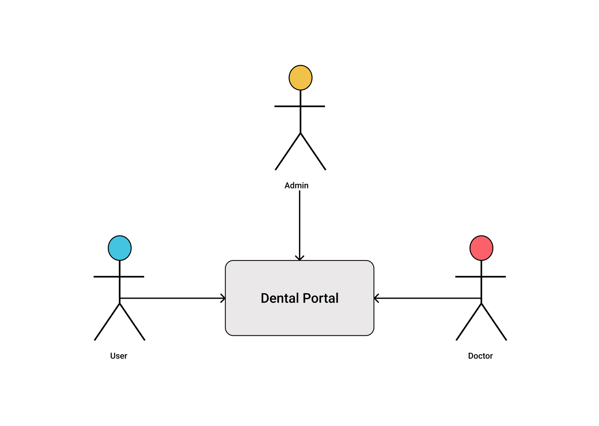
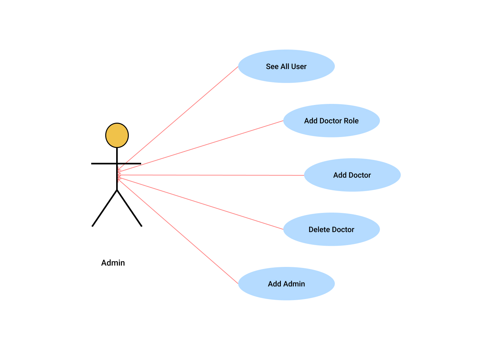
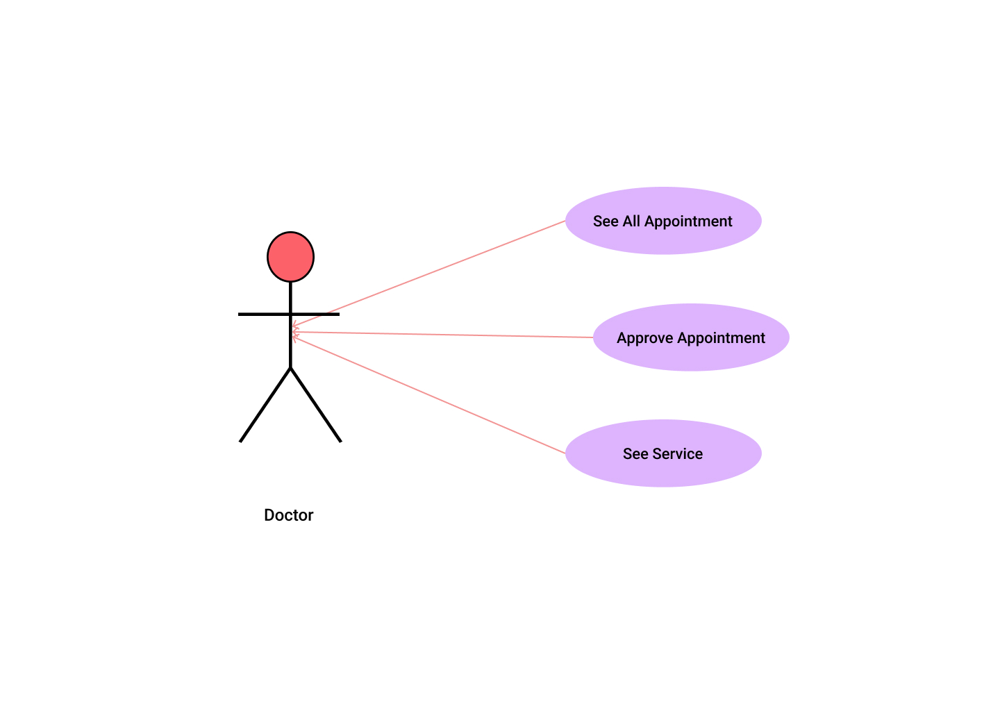

Dental's' Portal

### Description:

Dental is one of the most common issues for a person’s life. If anybody wants to visit a dentist for service or checkup, he or she needs to visit the hospital and have to find out if space/services are available or not. The patient also waits in a queue while getting an appointment.He/She also doesn’t know which time they should visit.Vision of this project is to create a doctor patient handling management system that will help patients to book doctor appointments and fulfill their prospects.

admin role:

email:[admin@admin.com](mailto:admin@admin.com)

password:123456

doctor role:

doctor@xyz.com

password:123456

### Technologies:

Front-end:

* React
* React router
* React day picker
* React hook form
* React toastify
* React query
* Tailwind CSS
* Firebase
* date-fns

Back-end:

* Node js
* JWT
* Express js
* MongoDB
* Node mailer
* Cors

Users:

Admin Activity:

Doctors Activity:

Client side code: [https://github.com/Mrinmoy09/DP-frontend]()

Server-side code: [https://github.com/Mrinmoy09/DP-backend]()

Live site: [hhttps://dental-portal-7153d.web.app/](https://doctors-portal-b19c5.web.app/)
